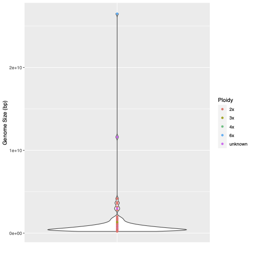

```{js logo-js, echo=FALSE}
$(document).ready(function() {
  $('#header').parent().prepend('<div id=\"logo\"></div>');
  $('#header').css('margin-right', '120px')
});
```

```{r packages, echo=FALSE, warning=FALSE, include=FALSE}
library(knitr)
library(rmarkdown)
library(bookdown)
#library(distill)
library(knitcitations)
library(formatR)
library(devtools)
library(kfigr)
library(dplyr)
library(kableExtra)
library(ggplot2)
library(rentrez)
library(easyPubMed)

#Generate BibTex citation file for all R packages used to produce report
knitr::write_bib(.packages(), file = 'packages.bib')
```

<div style="text-align: right"> [Raw data on GitHub](https://github.com/svenbuerki/VanillaGenomicsCode) </div>

<!-- The website is here: https://svenbuerki.github.io/VanillaGenomicsCode/ -->

# Introduction

To conduct a literature review on genomic heterozygosity levels in plants inferred using approaches implemented in GenomeScope [@genomescope] and GenomeScope v.2.0 [@RanalloBenavidez2020], an R function (`CitedInExtractoR`) was developed. This function takes unique PubMed IDs as input and retrieves citations of publications citing these studies. Publications were manually inspected to extract genomic heterozygosity values, taxonomy, ploidy and estimated genome size. Data were summarized using violin plots. Sections below provide the code to execute the analyses presented here.

## Retriving publications citing GenomeScope

The function used to retrieve publications citing GenomeScope software is presented below and depends on *rentrez* and *easyPubMed* R packages. To install these packages do:

```{r eval=FALSE, echo=TRUE}
#Install packages
install.packages(c("rentrez", "easyPubMed"))
```

### CitedInExtractoR function

This function needs to be sourced prior to conducting the analyses.

```{r eval=FALSE, echo=TRUE}
#A function to list publications citing a target article and 
# downloading data on these latter publications
CitedInExtractoR <- function(PubMedID){
  print(paste("Fetch data associated to", PubMedID, sep = " "))
  #Search data associated to PubMedID in pubmed
  src <- rentrez::entrez_link(dbfrom = "pubmed", id = PubMedID, db = "pubmed")
  
  print(paste("Extract list of publications citing", PubMedID, sep = " "))
  #Extract PubMedIDs of pubs citing our target Pub (= vect of pubmedIDs)
  citedIn <- src$links$pubmed_pubmed_citedin
  print(paste(PubMedID, "is cited in", length(citedIn), "publications", sep = " "))
  #Create empty object to save output of loop
  OUT <- NULL
  #Generate table with output data
  print(paste("Download data on publications citing", PubMedID, sep = " "))
  #Set a progress bar
  pb <- txtProgressBar(min = 0, max = length(citedIn), style = 3)
  for(i in 1:length(citedIn)){
    RefData <- rentrez::entrez_fetch(db = "pubmed", id = citedIn[i], rettype = "xml")
    tabPubMed <- easyPubMed::article_to_df(RefData)[1,]
    OUT <- rbind(OUT, tabPubMed)
    # update progress bar
    setTxtProgressBar(pb, i)
  }
  close(pb)
  
  #Add col with TargetPubMed ID
  TargetPubMed <- rep(PubMedID, nrow(OUT))
  
  #Add col with clickable DOI
  paste(rep("http://doi.org/", nrow(OUT)), OUT$doi, sep = "")
  #FINAL dataset
  FINAL <- cbind(TargetPubMed, OUT)
  
  FINAL
}
```

### Applying CitedInExtractoR to retrive publications

`CitedInExtractoR` was applied on PubMed IDs for GenomScope publications to retrieve publications citing these software (executed on March 29th 2022).

```{r eval=FALSE, echo=TRUE}
# Load packages
library(rentrez)
library(easyPubMed)

# List PubMed IDs for GenomeScope publications
PubMedID <- c("28369201", "32188846")

# Apply function across PubMedId vector
DatPubMed <- NULL
for(i in 1:length(PubMedID)){
  tmp <- CitedInExtractoR(PubMedID[i])
  DatPubMed <- rbind(DatPubMed, tmp)
  #Add a URLs to directly access to DOIs
  DatPubMed$URLDOI <- paste(rep("http://doi.org/", nrow(DatPubMed)), DatPubMed$doi, sep = "")
}

# Write data out (as csv)
write.csv(DatPubMed, file = "PubCitedIn_GenomeScope_publications_28369201_32188846_29March2022.csv", row.names = F, quote=T)
```

## Summarizing extracted data 

The code below was used to summarize the genomic data using the R package *ggplot2*.

```{r eval=FALSE, echo=TRUE}
####Creating plots using genomic and plant usage data####
##Paige Ellestad
##June 6th, 2022

#load Genomescope review data
data <- read.csv("PubCitedIn_GenomeScope_publications_28369201_32188846_29March2022 - PubCitedIn_GenomeScope_publications_28369201_32188846_29March2022.csv")

#change genome size and heterozygosity values to numericals
data$Heterozygosity_Perc <- as.numeric(data$Heterozygosity_Perc)
data$GS_bp <- as.numeric(data$GS_bp)

#For rows with ploidy levels as "na", change to "unknown" (for plots)
data$Ploidy[which(data$Ploidy == "na")] <- "unknown"

#Make Ploidy levels and Plant assignation factors
data$Ploidy <- as.factor(data$Ploidy)
data$Plant <- as.factor(data$Plant)

##make two subsets of data for separate heterozygosity and genome size plots
#subset data to exclude rows without heterozygosity values
data_het <- data[!is.na(data$Heterozygosity_Perc),]

#subset data to exclude rows without genome size values
data_gensize <- data[!is.na(data$GS_bp),]

##use ggplot2 to make violin plots of distributions
library(ggplot2)

#heterozygosity plot
#assign labels to chosen species (this was manually done within the Genomescope review 
#dataset by adding a "1" in a new column "figure" for species to be labelled within the plot)
species_labels <- data_het[which(data_het$figure == 1),]

#Make basic violin plot grouped by ploidy levels
grouped_plot <- ggplot(data_het, aes(x=Ploidy, y=Heterozygosity_Perc)) + 
  geom_violin() 

#Make labelled, colored violin plot with all ploidy levels in one plot
het_plot <- 
  ggplot(data_het, aes(x=Plant, y=Heterozygosity_Perc)) + 
  geom_violin() +
  geom_text(data=species_labels,aes(x=Plant, y = Heterozygosity_Perc,label=Species, 
                                    color = Ploidy),hjust=0, nudge_x = .01, vjust=.35, size= 3)+
  geom_point(aes(color = Ploidy)) +
  xlab("") +
  ylab("Genomic Heterozygosity(%)") +
  theme_classic() +
  theme(legend.title.align = 0.5, axis.ticks.x = element_blank(),
        axis.text.x = element_blank())

#Print to a pdf
pdf("het_violin_plot.pdf")
het_plot
dev.off()

#genome size plot
gensize_plot <- 
  ggplot(data_gensize, aes(x=Plant, y=GS_bp)) + 
  geom_violin() +
  geom_point(aes(color = Ploidy)) + 
  xlab("") +
  ylab("Genome Size (bp)") +
  theme(axis.ticks.x = element_blank(),
        axis.text.x = element_blank())

#print to a pdf
pdf("gensize_violin_plot.pdf")
gensize_plot
dev.off()
```

## Output

The graph showing variation in genomic heterozygosity levels by ploidy in plants inferred by GenomeScope is in Figure \@ref(fig:Hete) and data on genome size variation for the same data is presented in Figure \@ref(fig:GS).

```{r Hete, echo=FALSE, fig.cap="GenomeScope output showing variation in heterozygosity levels in plants.", out.width = '80%'}
knitr::include_graphics("Images/het_violin_plot.png")
```

```{r GS, echo=FALSE, fig.cap="GenomeScope output showing variation in genome size levels in plants.", out.width = '80%'}

```


# References

<div id="refs"></div>

# Appendix 1 {.appendix}

Citations of all R packages used to generate this report. 

```{r generateBibliography, eval = T, results="asis", cache = F, echo=F, warning = FALSE, message=FALSE}
library("knitcitations")
cleanbib()
options("citation_format" = "pandoc")
read.bibtex(file = "packages.bib")
``` 
