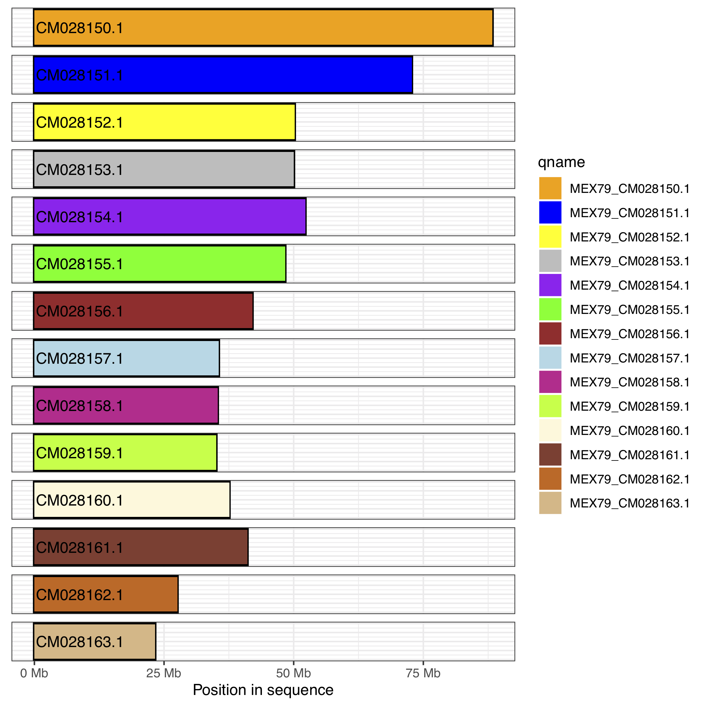
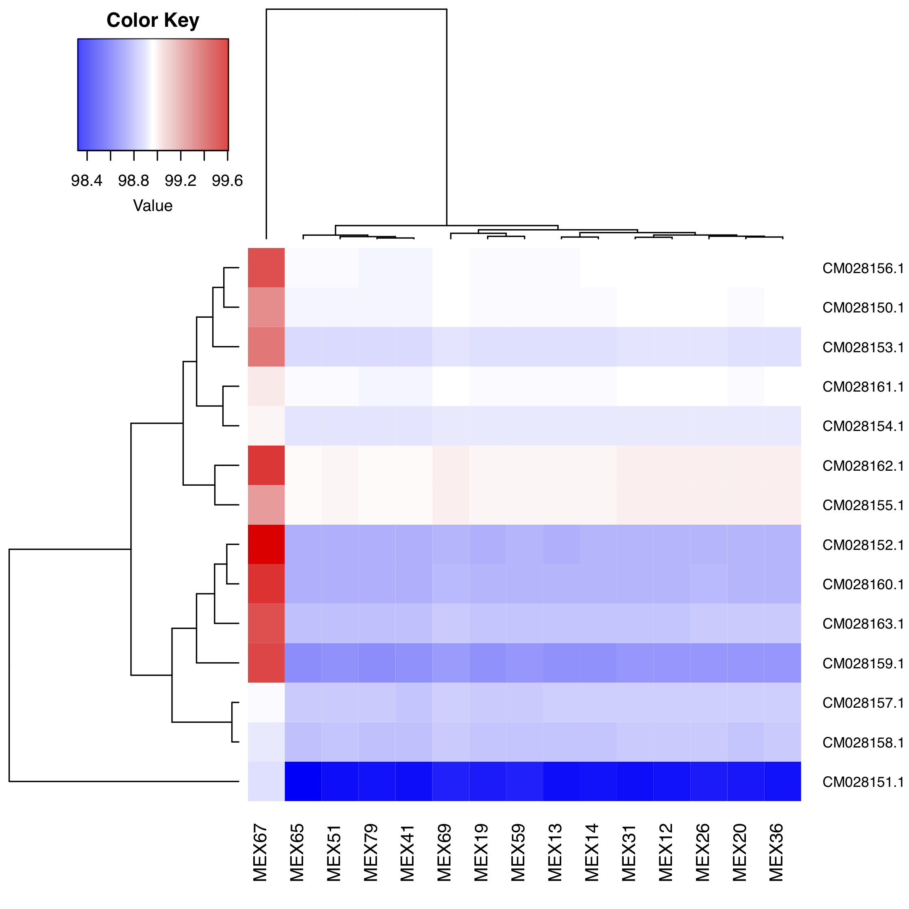
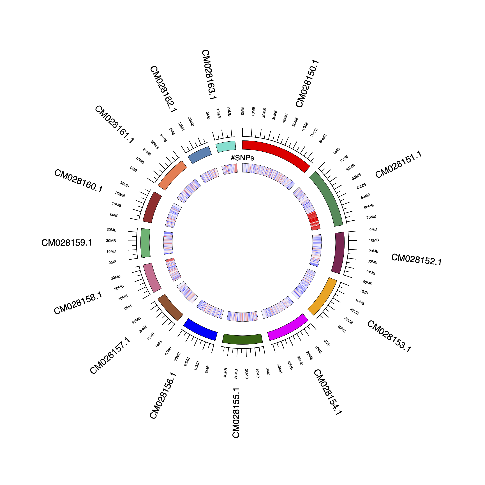

```{js logo-js, echo=FALSE}
$(document).ready(function() {
  $('#header').parent().prepend('<div id=\"logo\"></div>');
  $('#header').css('margin-right', '120px')
});
```

```{r packages, echo=FALSE, warning=FALSE, include=FALSE}
library(knitr)
library(rmarkdown)
library(bookdown)
#library(distill)
library(knitcitations)
library(formatR)
library(devtools)
library(kfigr)
library(dplyr)
library(kableExtra)
library(tufte)
require(leaflet)

library(magick)
library(pafr, quietly=TRUE)
#library("gplots")
library(SNPRelate)
library(gdsfmt)
library(R.utils) # This package is used to uncompress vcf.gz file
library(seqinr)
library(RCircos)

#Generate BibTex citation file for all R packages used to produce report
knitr::write_bib(.packages(), file = 'packages.bib')
```

<div style="text-align: right"> [Raw data on GitHub](https://github.com/svenbuerki/VanillaGenomicsCode) </div>

<!-- The website is here: https://svenbuerki.github.io/VanillaGenomicsCode/ -->

# Introduction

This reproducible report provides evidence on the data, software, packages and code used to perform the genomic analyses described in @Ellestad2022b. All the analyses were performed on a DELL Precision 7920 with the Ubuntu 18.04.6 LTS (GNU/Linux 4.15.0-177-generic x86_64) OS at Boise State University (ID, USA) between January and June 2022.

# Sampling

This study focuses on *Vanilla planifolia* (Orchidaceae) and the physical specimens are deposited at HEM (Universidad de Ciencias y Artes de Chiapas, Mexico) and SRP (Boise State University, Idaho, USA) (see Table \@ref(tab:tabsampling)).

## Distribution data

Map showing locations of the plantations where samples *Vanilla planifolia* were collected for this study is presented below together with images of plants in the field.

```{r map, echo=F, eval=T}
# Matrix of lat long for locations
loc <- read.csv("Data/reseq_mex_records.csv")
#Create vector connecting to thumbnail of images
loc$img <- paste0("Images/reseq_thumbnail_png/", loc$ID, ".png")
#MEX20 does nothave an image
loc$img[which(loc$ID == "MEX20")] <- ""

#Subset loc
loc <- loc[-which(loc$ID %in% c("MEX6")),]

#Create popup
contenido <- paste(sep = "<br/>",
                   paste0(""),
                   paste0("<b>Sample ID: </b>", loc$ID),
                   paste0("<b>Municipality: </b>", loc$municipality)
                   )

# Produce map
m <- leaflet(width = "100%") %>%
      addTiles() %>%
      addMarkers(lat = round(as.numeric(loc$latitude),3), label = loc$ID, lng = round(as.numeric(loc$longitude),3))
#addMarkers(lat = round(as.numeric(loc$latitude),3), label = loc$ID, lng = round(as.numeric(loc$longitude),3), popup = contenido)
m
```

## Genomic data

This project relies on paired-end Illumina short-read data (2x150bp) in `fastq.gz` format generated on an Illumina HiSeq 2500 instrument by Azenta (New Jersey, USA). The data produced in this project are deposited on NCBI under BioProject (PRJNA841950) and SRA accessions SRR19374404-SRR19374419 (see Table \@ref(tab:tabsampling)). We are also using data from the BioProject [PRJNA633886](https://www.ncbi.nlm.nih.gov/bioproject/PRJNA633886/) published in @Hasing2020. The haploid genome size for the reference genome [GCA_016413915.1](https://www.ncbi.nlm.nih.gov/assembly/GCA_016413895.1) is 736,752,966 bp. This value was used to infer raw genome coverage presented in Table \@ref(tab:tabsampling). We aimed at sequencing the genome at 50x due to the observed high genome-wide heterozygosity level [@Hasing2020].

```{r tabsampling, eval = T, echo=F, warning = FALSE, message=FALSE}
###~~~
#Read in tsv with sampling data
###~~~
tsv <- read.csv("Data/metadata-11482489-processed-ok.tsv", sep = "\t") 

###~~~
#Produce final table
###~~~

#Order table
tsv <- tsv[order(tsv$sample_name),]
rownames(tsv) <- NULL

#Red tsv to key data
redtsv <- tsv[,c(6, 5, 1, 21)]
#Rm 2 samples for which we have limited genomic data
rmSample <- c("MEX6")
redtsv <- redtsv[-match(rmSample, redtsv$sample_name),]
colnames(redtsv) <- c("Sample_ID", "BioSample", "SRA", "# Reads")

#Infer Yield and Coverage
# Yield = # reads * 300bp
redtsv$`Yield (Mbases)` <- round(as.numeric(redtsv$`# Reads`*300)/10e6, 3)
# Coverage = Yield (Mbases)/736752966
redtsv$`Sequencing coverage (x)` <- round(as.numeric(redtsv$`# Reads`*300)/736752966,2)

###~~~
#Plot timetable in doc
###~~~
#Plot table
#DT::datatable(redtsv, extensions = 'Buttons', options = list(dom = 'Blfrtip', buttons = c('copy', 'csv', 'excel', 'pdf', #'print')), rownames= FALSE) %>%
#  DT::formatStyle('Sample_ID', fontWeight = 'bold')

#Plot table
row.names(redtsv) <- NULL
knitr::kable(as.data.frame(redtsv), caption = "Table showing the Vanilla planifolia sampling used in this study together with information on the genomic data available on NCBI.") %>%
  kable_styling(bootstrap_options = c("striped", "hover", "condensed"))

```

## How to infer number of reads

To infer rhe number of reads in a `fastq.gz` file using `bash` do the following:
```{r readsSeq, eval= F, echo = T}
zcat 12_R2_001.fastq.gz | echo $((`wc -l`/4)) #Adjust file name
```

# Overview of analytical workflow

This section provides an overview of the analyses conducted in this study aiming at comparing the genome complexity and structure of samples of *Vanilla planifolia* from Mexico and data available on NCBI (see Table \@ref(tab:tabsampling)). Details on the software and associated code for the following analyses are presented in this document: 

1. [Setting working environment](#setenv).
2. [Downloading SRA files](#dwndata).
3. [Conducting reads trimming](#trim).
4. [Genome size and heterozygosity](#GS).
5. [Ploidy level and genome complexity](#cyt).
6. [Reconstructing genome sequences](#conseq).
7. [Comparative chromosome level analyses](#comgen).

# Setting working environment {#setenv}

## Project structure {#prjstr}

An overview of our project structure is presented here to facilitate the understanding of the data flow and code (see Figure \@ref(fig:prjstr)).

```{r prjstr, echo=FALSE, fig.cap="Overview of the project structure applied to analyze data for the Vanilla genomics project.", out.width = '100%'}
knitr::include_graphics("Images/Project_str_VanillaCode.png")
```

A summary of the content of each folder is provided here (in alphabetical order):

- `Bowtie`: Contains `sam`, `bam`, `bcf` and `fa` files associated to read mapping analyses to assemble *Vanilla* genomes from Illumina short-read data using the *Vanilla planifolia* (Daphna) reference genome ([GCA_016413895.1](https://www.ncbi.nlm.nih.gov/data-hub/genome/GCA_016413895.1/)). 
- `DotPlot`: Contains `html` and `png` files associated to the dotplot analyses of the *Vanilla* genomes.
- `GenomeScope`: Contains GenomeScope output files (`png`) generated using output of the JellyFish analyses.
- `Heatmap`: Contains `csv` and `pdf` files associated to the percentage identity analyses at chromosome level.
- `JellyFish`: Contains the `histo` files associated to the k-mer frequency analyses conducted in JellyFish and used as input for the `GenomeScope` analyses.
- `Minimap2`: Contains the `paf` files from the `Minimap2` analyses used to conduct the dotplot, heatmap and genome coverage analyses.
- `Pafr`: Contains `pdf` files associated to the genome coverage maps inferred using `paf` files. This folder is entitled `Pafr` because the coverage maps are inferred using the r package *pafr*.
- `Raw_Data`: Contains `fastq.gz` files associated to the raw Illumina data used for this project.
- `Reference_genome`: Contains `fna` files for the *Vanilla planifolia* (Daphna) reference genome ([GCA_016413895.1](https://www.ncbi.nlm.nih.gov/data-hub/genome/GCA_016413895.1/)) as well as the index files for the read mapping analyses.
- `Smudgeplot`: Contains `kmctools` output files used for the Smudgeplot analyses.
- `Trimmomatic`: Contains `trimmed.fastq.gz` files used as input for the genomic analyses.

## Bioinformatic tools

Analyses presented in this report are requiring a UNIX-based OS (tested on Ubuntu 18.04.6 LTS) and `ssh` and `tmux` protocols should be installed. Please see this [website](https://svenbuerki.github.io/Genomics-Bioinformatics/Tutorials.html) for more details and documentation. In addition, `R` is frequently used to tidy data and produce figures. All the `R` analyses were performed using R version 4.0.2 (2020-06-22) -- "Taking Off Again" and the software can be downloaded [here](https://www.r-project.org).

Dependencies associated to each analysis will be presented alongside the code. 

## Getting ready!

We start by *i*) remotely accessing the Linux computer using `ssh` protocol (you need your user ID and IP address), *ii*) launching a `tmux` session (safe environment that can be accessed from different locations) and *iii*) navigating to the project folder (here `Vanilla_SRA`) as follows:

<!-- SSH CONNEXION -->
```{bash sshTerminal, echo=FALSE, eval= F, warning=FALSE, include=FALSE}
#Send command to terminal with Ctrl+Option+Enter
ssh svenbuerki@132.178.142.206
cd /media/SeaGate/Vanilla_SRA/Raw_Data/
```

```{bash echo=T, eval = F}
# 1. Remotely connect to computer using ssh (adjust with your credentials/IP)
ssh userID@IP

# 2. Start tmux session (to exit tmux session type Ctrl+b and d)
tmux

# 3.  Navigate to project location (adjust path)
cd /media/SeaGate/Vanilla_SRA/Raw_Data/
```

More information on the project structure can be found [here](#prjstr).

# Downloading SRA files {#dwndata}

## Data requirements

- **Input:** `SRA` accession number from NCBI (see Table \@ref(tab:tabsampling)).
- **Output:** Split `fastq.gz` files with R1 and R2 paired-end reads.

## Dependencies

`SRA` files are downloaded using `parallel-fastq-dump`, which is available on [GitHub](https://github.com/rvalieris/parallel-fastq-dump). It can also be installed with [Bioconda](https://anaconda.org/bioconda) as follows:

```{bash echo = T, eval = F}
# Install program with Bioconda
conda install parallel-fastq-dump
```

## Code

Here, we need to *i*) create the `$SRA` variable with `SRA` accession number of data to be downloaded (see Table \@ref(tab:tabsampling)), *ii*) navigate to right folder (where data will be saved; here `Raw_Data/`) and *iii*) download `SRA` files (R1 and R2) using `parallel-fastq-dump`. This program allows parallelizing the downloading process and greatly reduces the downloading time. In this case, the files that we are downloading are compressed (`gz`) and they are in `fastq` format generated by Illumina instruments. The commands are available below:

```{bash echo = T, eval = F}
# 1. Create variable with sample SRA accession (as provided on NCBI)
SRA=SRR12628846 && # V. planifolia 'Hawaii'

# 2. Navigate to right location
cd Raw_Data/ &&

# 3. Download SRA files (R1 and R2) with parallelfastq (using 26 threads)
parallel-fastq-dump -O . --sra-id $SRA --threads 26 --split-files --gzip
```

# Conducting reads trimming {#trim}

Here, we use `Trimmomatic` [@Bolger2014] to clean/trim the Illumina paired-end reads from previous step.

## Data requirements

- **Input:** For each `SRA`, R1 and R2 `fastq.gz` files.
- **Output:** Four files, but only `$SRA_R1_trimmed.fastq.gz` and `$SRA_R2_trimmed.fastq.gz` containing cleaned paired reads from `Trimmomatic` will be used for downstream analyses.

## Dependencies

You can obtain and install `Trimmomatic` directly from [GitHub](https://github.com/usadellab/Trimmomatic).

## Code

To clean/trim the Illumina reads do as follows:

```{bash echo = T, eval = F}
# 1. Navigate to right location
cd ../Trimmomatic &&

# 2. Conduct reads trimming
TrimmomaticPE -threads 30 /media/SeaGate/Vanilla_SRA/Raw_Data/"$SRA"_1.fastq.gz /media/SeaGate/Vanilla_SRA/Raw_Data/"$SRA"_2.fastq.gz "$SRA"_1_trimmed.fastq.gz "$SRA"_1_UNPAIRED.fastq.gz "$SRA"_2_trimmed.fastq.gz "$SRA"_2_UNPAIRED.fastq.gz LEADING:3 TRAILING:3 SLIDINGWINDOW:4:15 MINLEN:100
```

# Genome size and heterozygosity {#GS}

In this section, we are providing information to estimate genome sizes and levels of heterozygosity for the *Vanilla planifolia* samples inferred using the approach implemented in `GenomScope 2.0` [@RanalloBenavidez2020], which relies on k-mers (k=21) inferred by `JellyFish` [@Jellyfish2011].

## Data requirements

- **Input:** `$SRA_R1_trimmed.fastq.gz` and `$SRA_R2_trimmed.fastq.gz` containing cleaned paired reads from `Trimmomatic`.
- **Output:** `21mer_trimmed_"$SRA"_pe12.histo` files from `JellyFish` used as input for the `GenomeScope 2` analysis. The latter analysis will generate plots stored in `png` format. You will also need to store `kcov` provided by `GenomeScope 2` for the `smudgeplot` analyses.

## Dependencies

`GenomScope 2.0` is available on [GitHub](https://github.com/tbenavi1/genomescope2.0) and `JellyFish` is available [here](https://genome.umd.edu/jellyfish.html#Release).

## Code

The commands to conduct these analyses are as follows:

```{bash echo = T, eval = F}
# 1. Navigate to right location
cd ../JellyFish &&

# 2. Generate histo file with JellyFish
jellyfish count -t 30 -C -m 21 -s 5G -o 21mer_trimmed_"$SRA"_pe12 <(zcat /media/SeaGate/Vanilla_SRA/Trimmomatic/"$SRA"_1_trimmed.fastq.gz) <(zcat /media/SeaGate/Vanilla_SRA/Trimmomatic/"$SRA"_2_trimmed.fastq.gz) && 
jellyfish histo -o 21mer_trimmed_"$SRA"_pe12.histo 21mer_trimmed_"$SRA"_pe12

# 3. Use GenomeScope 2.0 to infer genome size and level of heterozygosity
# Run locally using GenomeScope R package (must be installed)
genomescope.R -i 21mer_trimmed_"$SRA"_pe12.histo -o output -k 21
# Or go online ti run analysis with histo file
http://qb.cshl.edu/genomescope/genomescope2.0/
```

**Note:** You need to record `kcov` from the `GenomeScope` output to set the `L` parameter in the `smudgeplot` analysis (Figure \@ref(fig:GenomeScopeFig)).

## Output

Please find below an example of the output from `GenomeScope2` (Figure \@ref(fig:GenomeScopeFig)). The `kcov` variable that we will ne needing for the `smudgeplot` analysis is available in the header of Figure \@ref(fig:GenomeScopeFig).

```{r GenomeScopeFig, echo=FALSE, fig.cap="Example of a GenomeScope output.", out.width = '100%'}

```

However, sadly, the output of the `GenomeScope2` analysis do not contain information on the sample and we are proposing here some `R` code to add this information to all the `png` outputs.

## Processing outputs

The code below relies on the `R` package *magick*, which can be installed as follows:

```{r echo = T, eval = F}
#Launch R and then type this command
install.packages("magick")
```


```{r eval=FALSE, echo = T}
###~~~
#Process png output from GenomeScope
###~~~
# Aim: Add Sample ID to GenomeScope png
# Output: Newly annotated png images will be saved in /GenomeScope_annotated folder.

#1. Load package
library(magick)

#2. List of 
imgList <- list.files("Images/GenomescopeV2_images/", pattern = ".png", full.names = T)

#3. Create vector with sample IDs
SamplesID <- gsub(".png", "", gsub("Van", "MEX", sapply(strsplit(imgList, split = "//"), "[[", 2)))
#4. Create path object
path <- strsplit(imgList[1], "//")[[1]][1]

#5. Annotate images and save them in GenomeScope_annotated folder
for(i in 1:length(imgList)){
  #Open png
  imraw <- magick::image_read(imgList[i])
  
  #Annotate png with sample ID
  imprep <- magick::image_annotate(imraw, SamplesID[i], size = 50, color = "black", location = "+140+50")
  
  #Save images in GenomeScope_annotated
  #Check if folder exists
  # if not then creates it
  output_dir <- file.path(paste0(path, "/GenomeScope_annotated"))
    
  if(dir.exists(output_dir)){
    #print(paste0("Dir", output_dir, " already exists!"))
  }else{
    print(paste0("Created ", output_dir))
    dir.create(output_dir)  
  }
  
  #Save annotated image  
  magick::image_write(imprep, path = paste0(output_dir, "/Annotated_", SamplesID[i], ".png"))
  
}
```

Here is an example of the newly annotated output `png` file (see Figure \@ref(fig:GenomeScopeFigAnn)).

```{r GenomeScopeFigAnn, echo=FALSE, fig.cap="Example of a newly annotated GenomeScope output with sample ID.", out.width = '100%'}
knitr::include_graphics("Images/GenomescopeV2_images/GenomeScope_annotated/Annotated_MEX67.png")
```

# Ploidy level and genome complexity {#cyt}

Ploidy levels of *Vanilla planifolia* samples and their genomic complexity (focusing on heterozygous k-mers) were inferred by applying the approach implemented in `smudgeplot` [@RanalloBenavidez2020], which relies on k-mers (k=21) inferred by `KMC` [@KMC2017]. 

## Data requirements

- **Input:** `$SRA_R1_trimmed.fastq.gz` and `$SRA_R2_trimmed.fastq.gz` containing cleaned paired reads from `Trimmomatic` and `kcov` values from the `GenomeScope` analyses.
- **Output:** `kmcdb_"$SRA"_L"$L"_U"$U"_coverages.tsv` files from `KMC`. These files will be used as input for the `smudgeplot` analyses, which will output plots in `png` format.

## Dependencies

`KMC` is available on [GitHub](https://github.com/refresh-bio/KMC) and `smudgeplot` is also available on  [GitHub](https://github.com/KamilSJaron/smudgeplot).

## Code

The commands to conduct these analyses are as follows:

```{bash echo = T, eval = F}
# 1.Navigate to right folder
cd ../Smudgeplot/ &&

# 2. Conduct smudgeplot to infer ploidy and genome complexity
# list files for kmc tools analysis
ls /media/SeaGate/Vanilla_SRA/Trimmomatic/"$SRA"_R*_trimmed.fq.gz > FILES_"$SRA" &&
# kmer 21, 30 threads, 128G of memory, counting kmer coverages between 1 and 10000x
kmc -k21 -t30 -m128 -ci1 -cs10000 @FILES_"$SRA" kmcdb_"$SRA" . &&
kmc_tools transform kmcdb_"$SRA" histogram kmcdb_k21_"$SRA".hist -cx10000 &&

# Declare variable 
kcov=32 #Please edit based on GenomeScope analysis

# Define L = (kcov/2) - 5 # As proposed in smudgeplot manual
L=$(expr $kcov / 2 - 5) &&
U=$(smudgeplot.py cutoff kmcdb_k21_"$SRA".hist U) &&

echo $L $U # these need to be sane values &&
# L should be like 20 - 200
# U should be like 500 - 3000

kmc_tools transform kmcdb_"$SRA" -ci"$L" -cx"$U" reduce kmcdb_"$SRA"_L"$L"_U"$U" &&
smudge_pairs kmcdb_"$SRA"_L"$L"_U"$U" kmcdb_"$SRA"_L"$L"_U"$U"_coverages.tsv kmcdb_"$SRA"_L"$L"_U"$U"_pairs.tsv > kmcdb_"$SRA"_L"$L"_U"$U"_familysizes.tsv

# Generate the smudgeplot
#Run R code to produce smudgeplot (R package must be installed)
smudgeplot.py plot kmcdb_"$SRA"_L"$L"_U"$U"_coverages.tsv -o "$SRA"_L"$L"_U"$U" -k 21
```

## Output

Please find below an example of the output from `smudgeplot` (Figure \@ref(fig:smudeplot)).

```{r smudeplot, echo=FALSE, fig.cap="Example of a smudgeplot output (log10).", out.width = '80%'}
knitr::include_graphics("Images/Smudgeplot/Van67_L25_U800_smudgeplot_smudgeplot_log10.png")
```

# Reconstructing genome sequences {#conseq}

Genome reconstructions (at chromosome scale) were carried out by mapping the cleaned trimmed reads to the *Vanilla planifolia* Daphna reference genome ([GCA_016413895.1](https://www.ncbi.nlm.nih.gov/data-hub/genome/GCA_016413895.1/) in `fasta` format. Read mapping was conducted with `bowtie2` [@Langmead2012] and the consensus genome sequences (in `fasta` format) were reconstructed by using `samtools` and `bcftools` [@Danecek2021]. 

## Data requirements

- **Input:** `GCA_016413895.1_Elo_Vpla-A_principal_1.0_genomic_chrmosomes.fna` reference genome and `$SRA_R1_trimmed.fastq.gz` and `$SRA_R2_trimmed.fastq.gz` files.
- **Output:** `"$SRA"_consensus.fa` containing newly assembled genome sequences for each sample.

## Dependencies

`bowtie2` is available on [GitHub](https://github.com/BenLangmead/bowtie2), but it can also be installed with [Bioconda](https://anaconda.org/) as follows:

```{bash echo = T, eval = F}
#Install bowtie2 with Bioconda
conda install bowtie2
```

`samtools` and `bcftools` are available on [GitHub](https://github.com/samtools/).

## Code

The code to execute these analyses is presented below:

```{bash echo = T, eval= F}
# 1. Declare variable with sample name (if not already done)
SRA=Van65 && # Please adjust to your sample

# 2. Navigate to right folder
cd ../Bowtie &&

# 3. Create index of reference genome (this needs to be done only once)
bowtie2-build GCA_016413895.1_Elo_Vpla-A_principal_1.0_genomic_chrmosomes.fna GCA_016413895

# 4. Map reads on ref genome using bowtie
# Here we use the sensitive mode to be precise and 24 CPUs
bowtie2 --end-to-end --sensitive -p 24 -x ../Reference_genome/GCA_016413895 -1 ../Trimmomatic/"$SRA"_R1_trimmed.fq.gz -2 ../Trimmomatic/"$SRA"_R2_trimmed.fq.gz -S "$SRA".sam && # Not printing anything in console

# 5. Sort sam file and generate bam file
cat "$SRA".sam | samtools view -bS - | samtools sort -o "$SRA".bam &&

# 6. Call variants
bcftools mpileup  -Ou -f ../Reference_genome/GCA_016413895.1_Elo_Vpla-A_principal_1.0_genomic_chrmosomes.fna "$SRA".bam | bcftools call -vmO z -o "$SRA"_calls.vcf.gz &&

# 7. Index the calls
bcftools index "$SRA"_calls.vcf.gz &&

# 8. Normalize indels
bcftools norm -f ../Reference_genome/GCA_016413895.1_Elo_Vpla-A_principal_1.0_genomic_chrmosomes.fna "$SRA"_calls.vcf.gz -Ob -o "$SRA"_calls.norm.bcf &&

# 9. Filter adjacent indels within 5bp
bcftools filter --IndelGap 5 "$SRA"_calls.norm.bcf -Ob -o "$SRA"_calls.norm.flt-indels.bcf &&

# 10. Apply variants to create consensus sequence
cat ../Reference_genome/GCA_016413895.1_Elo_Vpla-A_principal_1.0_genomic_chrmosomes.fna | bcftools consensus "$SRA"_calls.vcf.gz > "$SRA"_consensus.fa
```

Because scaffolds in the newly produced consensus genome sequences have to the same names than in the reference file, we have developed an `R` code (relying on base `R` functions) to rename scaffolds based on sample ID. The code is as follows:

```{r eval = F, echo = T}
# Rename scaffolds in consensus fasta file

# 1. Launch R from the terminal
R

# 2. Set file name
SRA <- "Van65" # Please adjust to your sample

# 3. Load consensus fasta file
conFasta <- readLines(paste0(SRA, "_consensus.fa")) 

# 4. Extract old names
FastaNames <- conFasta[grep(">", conFasta)]

# 5. Build new names
NewNames <- gsub(">", paste0(">", SRA, "_"), sapply(strsplit(FastaNames, " "), "[[", 1))

# 6. Replace old scaffold names by new names
conFasta[grep(">", conFasta)] <- NewNames

# 7. Overwrite consensus file with new scaffold names
write.table(conFasta, paste0(SRA, "_consensus.fa"), row.names = F, col.names=F, quote = F)

# 8. Quit R
quit(save="no")
```

# Comparative chromosome level analyses {#comgen}

We applied the same approach than @Shirasawa2022 and compared chromosome-level genome sequences of *Vanilla planifolia* samples with `Minimap2` [@Li2018], and assessed genomic similarities by producing:

1. [**Dot plots**](#dotplot) with the R package [`pafCoordsDotPlotly`](https://github.com/tpoorten/dotPlotly). These analyses allowed further investigating putative chromosomal rearrangements and genomic similarities between the reference genome and each sample.
2. [**Genome coverage maps**](#covmap) with the R package [`pafr`](https://dwinter.github.io/pafr/index.html). Coverage maps allowed assessing for any chromosomal re-arrangements as well as evaluating coverage of our target sample compared to the reference genome.
3. [**A heatmap of chromosomal similarities**](#heatmap) using a custom `R` script relying on the R [`gplots`](https://github.com/talgalili/gplots) package. The heatmap shows percentage of identities between each sample and the reference genome at chromosome level. 
4. [**SNP calling and clustering analyses**](#SNPcallPCA) using `bcftools` and mainly R package *SNPRelate* based on the `bam` files from the genome reconstructions.

The first three comparative analyses rely on the output of the `Minimap2` analyses (in [`paf`](https://cran.r-project.org/web/packages/pafr/vignettes/Introduction_to_pafr.html#:~:text=PAF%20is%20a%20plain%20text,least%20the%20following%2012%20columns.&text=In%20addition%2C%20each%20row%20can,the%20SAM%20specification%20(pdf)) format), whereas the last analyses are based on the output of the genome reconstructions. 

Please find below information on the data, dependencies and code for each analysis.

## Genome alignments with `MiniMap2`

### Data requirements

- **Input:** `GCA_016413895.1_Elo_Vpla-A_principal_1.0_genomic_chrmosomes.fna` reference genome and `"$SRA"_consensus.fa` consensus assembly for each sample.
- **Output:** `aln_ref_asm10_"$SRA".paf` file with alignment statistics/data based on `MiniMap2` analysis.

### Dependencies

The protocol to install `minimap2` is described [here](https://github.com/lh3/minimap2). 

### Code

```{bash eval = F, echo = T}
#Note: This code produces an output in paf format. 

# 1. Declare variable with sample name (if not already done)
SRA=Van69

# 2. Navigate to right folder
cd ../Minimap2 &&

# 3. Conduct analysis with 1% of divergence between genomes (= asm10)
minimap2 -t26 -cx asm10 -k 21 ../Reference_genome/GCA_016413895.1_Elo_Vpla-A_principal_1.0_genomic_chrmosomes.fna ../Bowtie/"$SRA"_consensus.fa > aln_ref_asm10_"$SRA".paf #  asm5/asm10/asm20 - asm-to-ref mapping, for ~0.1/1/5% sequence divergence
```

### Output

Table \@ref(tab:paf) provides an example of an output a `Minimap2` analysis producing a file in `paf` format.

```{r paf, echo = F, eval=TRUE, warning = FALSE, message=FALSE}
###~~~
#Read in paf file
###~~~
paf <- read.csv("Data/aln_ref_asm10_Van67.paf", sep = "\t", header = F) 

###~~~
#Plot paf table
###~~~
#Plot table
knitr::kable(as.data.frame(paf), caption = "Example of an output of a Minimap2 analysis in PAF format.") %>%
  kable_styling(bootstrap_options = c("striped", "hover", "condensed"))

```

The `paf` file does not contain any headers, but information on the different variables is provided in Table \@ref(tab:pafheaders). In addition, each row can have a variable number of 'tags', which share a similar format to those used in SAM files (see the [SAM specification format](https://samtools.github.io/hts-specs/SAMtags.pdf)).

```{r pafheaders, echo = F, eval=TRUE, warning = FALSE, message=FALSE}
###~~~
#Read in paf headers
###~~~
paf <- read.csv("Data/PAF_col_key.csv") 

###~~~
#Plot paf table
###~~~
#Plot table
knitr::kable(as.data.frame(paf), caption = "Table providing information on the PAF format.") %>%
  kable_styling(bootstrap_options = c("striped", "hover", "condensed"))

```

## Dot plots {#dotplot}

### Data requirements

- **Input:** `aln_ref_asm10_"$SRA".paf` file with alignment statistics/data based on `MiniMap2` analysis.
- **Output:** Dot plots in `png` and `html` formats.

### Dependencies

Visit this [webpage](https://github.com/tpoorten/dotPlotly) to install the dependencies for the `pafCoordsDotPlotly.R` script. 

### Code 

```{r eval=FALSE, echo = TRUE}
# Note: This code outputs png and html documents

# 1. Navigate to right folder
cd ../DotPlot &&
  
# 2. Run analysis directly from terminal using Rscript
# You have to adjust file names 
Rscript pafCoordsDotPlotly.R -i /media/SeaGate/Vanilla_SRA/Minimap2/aln_ref_asm10_Van65.paf -o dotPlot_aln_ref_asm10_Van65 -s -t -m 10000 -q 50000 -k 14 -l # Provide name (change to VanXX)
```

### Output

Here is an example of the output of the dot plot analysis inferred with `pafCoordsDotPlotly.R` on `MEX67` (see Figure \@ref(fig:dotplot)).

```{r dotplot, echo=FALSE, fig.cap="Example of a newly annotated GenomeScope output with sample ID.", out.width = '100%'}
knitr::include_graphics("Images/dotPlot_aln_ref_asm10_Van67.png")
```

## Genome coverage maps {#covmap}

### Data requirements

- **Input:** `aln_ref_asm10_"$SRA".paf` file with alignment statistics/data based on `MiniMap2` analysis.
- **Output:** Coverage maps in `pdf` format.

### Dependencies

To install the `pafr` R package directly from the GitHub repository execute this R code:

```{r echo = T, eval= F}
#Install pafr with devtools
# If you don't have devtools do:
# install.packages(devtools)
devtools::install_github("dwinter/pafr")
```

### Code

The `R` code below infers a genome coverage map for a `.paf` file in `MiniMap2/` and saves it in a `pdf`.

```{r echo = T, eval=FALSE}
# 1. Navigate to right folder
cd ../Pafr &&

# 2. Lauch R in terminal
R

# 3. Load package
# Warning: Please install pafr with devtools prior to executing this code
library(pafr, quietly=TRUE)

# 4. Set file name
SRA <- "Van79" # Adjust name

# 5. Read in the PAF data (output of Minimap2)
ali <- pafr::read_paf(paste0("../Minimap2/aln_ref_asm10_", SRA, ".paf"))
# Adjust SRA name
ali$qname <- gsub("Van", "MEX", ali$qname)
  
# 6. Declare a vector of colors for coverage plot
my.cols <- c("orange", "blue", "yellow", "grey", "purple", "green", "brown", "lightblue", "maroon3", "greenyellow",  "cornsilk", "coral4", "chocolate", "burlywood")

# 7. Infer the coverage plot and save in pdf
pdf(paste0("Coverage_plot_ref_", SRA, "_asm10_Minimap2.pdf"))
plot_coverage(ali, fill='qname') + scale_fill_manual(values = my.cols)
dev.off()

# 8. Quit R
quit(save="no")
```

### Output

Here is an example of the output of the genome coverage map inferred with `pafr` on `MEX79` (see Figure \@ref(fig:covmap)).

```{r covmap, echo=FALSE, fig.cap="Example of a genome coverage map.", out.width = '100%'}

```

## Heatmap of chromosomal similarities {#heatmap}

Since the previous analyses did not unveil any chromosomal rearrangements, we have produced a heatmap to compare percentage identities between chromosomes (against the reference). To do that, we needed to start by inferring the percentage identities between each target chromosome and the reference genome as follows: `100*(nmatch/alen)` (see [here](https://cran.r-project.org/web/packages/pafr/vignettes/Introduction_to_pafr.html#:~:text=PAF%20is%20a%20plain%20text,least%20the%20following%2012%20columns.&text=In%20addition%2C%20each%20row%20can,the%20SAM%20specification%20(pdf)) for more details). 

### Data requirements

- **Input:** List of all the `aln_ref_asm10_"$SRA".paf` files with alignment statistics/data based on `MiniMap2` analyses.
- **Output:** A `csv` (`PercIdMat.csv`) with percentage similarities and a heatmap in `pdf` format.

### Dependencies

To install the R `gplots` package execute this code:

```{r eval = F, echo = T}
#Install gplots from CRAN
# Documentation: https://github.com/talgalili/gplots
install.packages('gplots')
```

### Code

The custom `R` code below (relying on base `R` functions) builds a matrix storing percentage identities for all samples, which will then be used as input to infer the heatmap.

```{r echo = T, eval = F}
# 1. Navigate to right folder
cd ../Minimap2 &&

# 2. Launch R from terminal
R

# 3. List all the PAF files in folder
PAFfiles <- list.files(pattern = ".paf")

# 4. Create list of reference scaffolds/chromosomes
RefChrom <- read.csv(PAFfiles[2], sep= "\t", header=F)
RefChrom <- unique(RefChrom[,6])

# 5. Create an empty matrix to store data (percentage identities)
PercIdMat <- matrix(ncol=length(PAFfiles), nrow=length(RefChrom))
rownames(PercIdMat) <- RefChrom
colnames(PercIdMat) <- PAFfiles

PercIdMat <- data.frame(PercIdMat)

# 6. Populate matrix with Perc identities
#Set a progress bar
pb <- txtProgressBar(min = 0, max = ncol(PercIdMat), style = 3)
for(i in 1:ncol(PercIdMat)){
 #Open PAF file
 print(paste("Process: ", colnames(PercIdMat)[i], sep = "")) 
 PAF <- read.csv(colnames(PercIdMat)[i], sep= "\t", header=F)
 #Infer Perc identity for each chr
 for(j in 1:nrow(PercIdMat)){
   tmp <- subset(PAF, PAF[,6] == rownames(PercIdMat)[j])
  if(nrow(tmp) > 1){
   #Multiple hits so do mean
   PercIdMat[j,i] <- mean(100*(tmp[,10]/tmp[,11]))
  }else{
  #Infer PercId
   PercIdMat[j,i] <- 100*(tmp[,10]/tmp[,11])
  }	
 }	
  #update progress bar
  setTxtProgressBar(pb, i)	
}
close(pb)

# 7. Write data out in Heatmap
# Adjust path
write.csv(PercIdMat, file = "/media/SeaGate/Vanilla_SRA/Heatmap/PercIdMat.csv", quote = F)
```

Now we can generate the heatmap with the `R` [*gplots*](https://github.com/talgalili/gplots) package as follows:

```{r eval = F, echo = T}
# 1. Load R package
# If not installed then do
# install.packages("gplots")
library("gplots")

# 2. Edit colnames and rownames for plot (from the PercIdMat object from previous code)
colnames(PercIdMat) <- gsub("Van", "MEX", gsub("aln_ref_asm10_", "", colnames(PercIdMat)))
colnames(PercIdMat) <- gsub(".paf", "", colnames(PercIdMat))
#rownames(PercIdMat) <- gsub("[.]1", "", rownames(PercIdMat))

# 3. Produce heatmap and save it in pdf
pdf("/media/SeaGate/Vanilla_SRA/Heatmap/Heatmap_chrom_Vanilla_2.pdf")
heatmap.2(as.matrix(PercIdMat), scale = "none", col = bluered(100), 
          trace = "none", density.info = "none", cexRow = .8)
dev.off()
```

### Output

Here is the heatmap generated for the *Vanilla planifolia* samples from Mexico comparing those with the reference genome (see Figure \@ref(fig:covmap)).

```{r heatmapplot, echo=FALSE, fig.cap="Heatmap of Vanilla planifolia samples. See text for more details.", out.width = '100%'}

```

## SNP calling, density and clustering analyses {#SNPcallPCA}

To further compare the genetic structure of the Mexican *Vanilla* samples, we have called and filtered SNPs across samples at different LD values and inferred SNP density maps. These data were used to conduct a principal component analysis (PCA) allowing assessing genetic structuring within samples (compared to the reference genome).  

### Data requirements

- **Input:** All `bam` files from the genome reconstruction analyses (see section \@ref(conseq)) as well as the `fasta` reference genome (`GCA_016413895.1_Elo_Vpla-A_principal_1.0_genomic_chrmosomes.fna`).
- **Output:** A compressed `vcf` file (`calls.vcf.gz`), which will be used as input for fitering SNPs and conducting PCA analysis. 

**Note:** VCF: The Variant Call Format (VCF), which is a generic format for storing DNA polymorphism data such as SNPs, insertions, deletions and structural variants, together with rich annotations.

### Dependencies

The first part of the analyses depend on `bcftools`, which is available on [GitHub](https://github.com/samtools/), whereas the rest of the analyses are conducted in R and requires packages deposited on BioConductor. To install them execute the following code:

```{r eval=FALSE, echo=TRUE}
# Install packages from BioConductor
# check is BiocManager package is available, 
# if not then install it before pursuing code
if (!require("BiocManager", quietly = TRUE))
  install.packages("BiocManager")

# Install gdsfmt and SNPRelate
BiocManager::install(c("gdsfmt", "SNPRelate"))

# Install R.utils from GitHub
remotes::install_github("HenrikBengtsson/R.utils", ref="develop")

# Install RCircos for SNP density map
install.packages("RCircos")

# Install seqinr
install.packages("seqinr")
```

### Code

Merge all the `bam` files from the genome reconstruction analyses (stored in the `Bowtie` folder) and use `bcftools` to call and filter variants (SNPs). Further variant filtering based on linkage disequilibrium is also done in R (see below) prior to inferring PCAs and SNP density maps (using a 500kb sliding window).

```{bash eval = F, echo = T}
# 1. Navigate to right folder
cd ../Bowtie &&

# 2. Do SNP calling across BAM files (merging them)
bcftools mpileup  -Ou -f ../Reference_genome/GCA_016413895.1_Elo_Vpla-A_principal_1.0_genomic_chrmosomes.fna *bam | bcftools call -vmO z -o calls.vcf.gz &&

# 3. Filter variants
bcftools view -i '%QUAL>=20' calls.vcf.gz &&

# 4. Index the calls
bcftools index calls.vcf.gz &&

# 5. Normalize indels
bcftools norm -f ../Reference_genome/GCA_016413895.1_Elo_Vpla-A_principal_1.0_genomic_chrmosomes.fna calls.vcf.gz -Ob -o calls.norm.bcf &&

# 6. Filter adjacent indels within 5bp and save output
bcftools filter --IndelGap 5 calls.norm.bcf -Ob -o calls.norm.flt-indels.bcf &&

bcftools view calls.norm.flt-indels.bcf | vcfutils.pl varFilter - > vanilla_SNP-final.vcf
```

Here is the R code to further filter the SNPs and conduct the PCA analysis.

```{r eval = F, echo = T}
# 1. Navigate to right folder
cd ../Bowtie && # To facilitate analyses, the file where stored in a SNPs subfolder
  
# 2. Launch R from terminal
R

# 3. Load packages
library(SNPRelate)
library(gdsfmt)
library(R.utils) # This package is used to uncompress vcf.gz file

# 4. Uncompress VCF file
gunzip("SNPs/calls.vcf.gz", remove = FALSE)
# Check that file is uncompressed and stored 
file.exists("SNPs/calls.vcf") # logical should be TRUE

# 5. Convert VCF file into a less data intensive form (GDS: Genomic Data Structures) for easier computing and only retain bi-allelic SNPs
SNPRelate::snpgdsVCF2GDS(vcf.fn = "SNPs/calls.vcf", out.fn = "SNPs/calls.gds", method = "biallelic.only")

# 7. Check that gds file exists and print summary stats
file.exists("SNPs/calls.gds") # logical should be TRUE
SNPRelate::snpgdsSummary("SNPs/calls.gds")

# Printed output:
# The file name: /media/SeaGate/Vanilla_SRA/Bowtie/calls.gds 
# The total number of samples: 15 
# The total number of SNPs: 7468839 
# SNP genotypes are stored in SNP-major mode (Sample X SNP).

# 8. Open file
genofile <- SNPRelate::snpgdsOpen("SNPs/calls.gds")

# 9. Prune SNP set to account for linkage disequilibrium and perform PCA
# Call SNPs with multiple ld.threshold values
LDthresh <- c(0.2, 0.4, 0.6, 0.8)
#Loop to filter SNPs based on LD thresholds and infer PCA
for(i in 1:length(LDthresh)){
  #Set seed to ensure reproducibility
  set.seed(1234)
  
  #Filter SNPs based on LDthresh
  snpset <- SNPRelate::snpgdsLDpruning(genofile, ld.threshold = as.numeric(LDthresh[i]), autosome.only = FALSE, num.thread = 4) # Output = SNP.ID
  
  #Store Number of SNPs
  NSNPs <- sum(lengths(snpset))
  
  # Conduct PCA
  #get snp ids
  snpset.id <- unlist(snpset)
  pca <- snpgdsPCA(genofile, snp.id=snpset.id, num.thread=2, autosome.only = FALSE)
  
  # variance proportion (%)
  pc.percent <- round(pca$varprop*100, 2)
  
  #Store data in table for plotting
  tab <- data.frame(sample.id = pca$sample.id,
                  EV1 = pca$eigenvect[,1],    # the first eigenvector
                  EV2 = pca$eigenvect[,2],    # the second eigenvector
                  stringsAsFactors = FALSE)
  #Plot PCA and save in a pdf
  pdfFile <- paste0("Data/LD_", LDthresh[i], "_Vanilla.pdf")
  #Add text for 3 samples
  target.samples <- c("Van31.bam", "Van67.bam")
  #Subset tab to get x and y for plotting
  targettab <- subset(tab, tab$sample.id %in% target.samples)
  #Rename samples
  targettab$sample.id <- gsub("[.]bam", "", gsub("Van", "MEX", targettab$sample.id))
  
  #Save pdf 
  pdf(pdfFile)
  #Plot PCA
  plot(tab$EV1, tab$EV2, xlab=paste0("Eigen vector 1 (", pc.percent[1], "%)"), ylab=paste0("Eigen vector 2 (", pc.percent[2], "%)"), pch = 19, main = paste0("LD threshold of ", LDthresh[i], " resulting in ", NSNPs, " SNPs"))
  
  #Add target samples
  text(x = targettab$EV1, y = targettab$EV2+0.025, targettab$sample.id, cex = .8)
  dev.off()
  
}
```

Finally, here is the code to infer the SNP density maps at different linkage disequilibrium thresholds (0.2 and 0.8).

```{r eval = F, echo = T}
###
# R code to infer SNP density along moving window and produce a map

# 1. Load packages
library(seqinr)
library(RCircos)

# 2. Create a data.frame with SNP information
SNPsInfo <- data.frame(Chr = read.gdsn(index.gdsn(genofile, "snp.chromosome")), Position = read.gdsn(index.gdsn(genofile, "snp.position")), ID = read.gdsn(index.gdsn(genofile, "snp.id")))

# 3. Infer SNP density map
# - This needs info on length of chromosomes and called SNPs

#Load fasta of chromosomes
chrFasta <- seqinr::read.fasta("SNPs/GCA_016413895.1_Elo_Vpla-A_principal_1.0_genomic_chrmosomes.fna", forceDNAtolower = F)

# 4. Call SNPs with LD values, infer density along chr and produce map
#Set LD values
LD <- c(0.2, 0.8)

#Do a loop where SNPs are called at specific LD value and density map is inferred
for(j in 1:length(LD)){
  print("Calling SNPs")
  #Set seed to ensure reproducibility
  set.seed(1234)
 
  #Filter SNPs based on LD
  snpset <- SNPRelate::snpgdsLDpruning(genofile, ld.threshold = LD[j], autosome.only = FALSE, num.thread = 4) # Output = SNP.ID
    
  #Number of SNPs per chromosome
  write.csv(lengths(snpset), file = paste0("Data/SNP_chr_", LD[j], ".csv"))
  
  #Extract chr lengths
  chrLength <- as.matrix(summary(chrFasta)[,1])
  colnames(chrLength) <- "ChrLength"
  
  print("Infer SNP density along sliding window")
  SNPslidingdat <- NULL
  for(j in 1:nrow(chrLength)){
    chr <- rownames(chrLength)[j]
    slidwind <- 500000
    
    #Establish foundation for inferring nbr of SNP per sliding window length
    # Start by creating a vector to set the position on the sliding window
    starts <- seq(1, as.numeric(chrLength[match(chr, rownames(chrLength)),1])-as.numeric(slidwind), by = as.numeric(slidwind))
    
    #Create table with SNP position and ID for target chr
    chrDat <- subset(SNPsInfo, SNPsInfo$Chr == chr & SNPsInfo$ID %in% snpset[match(paste0("chr", chr), names(snpset))][[1]])
    
    # Set number of iterations in loop based on starts
    n <- length(starts)
      
    # Create an empty matrix to store GC values
    chunkData <- matrix(ncol=5, nrow=n)
    colnames(chunkData) <- c("Chromosome", "chromStart", "chromEnd", "SNP_nbr", "SNP_perc")
    chunkData <- as.data.frame(chunkData)
    chunkData$Chromosome <- rep(chr, nrow(chunkData))
    chunkData$chromStart <- starts
    chunkData$chromEnd <- as.numeric(chunkData$chromStart)+(as.numeric(slidwind)-1)
      
    ###
    # Sliding window: SNP nbr and percentages
    ###
    print(paste0("Processing chromsome: ", chr))
    pb <- txtProgressBar(min = 0, max = n, style = 3)
    for(i in 1:n){
      #Where are we in the loop
      #print(paste("Iteration:", i, "from", n, sep=' '))
      #Infer nbr of SNP in sliding window
      chunkData$SNP_nbr[i] <- length(which(chrDat$Position %in% seq(from = chunkData$chromStart[i], to = chunkData$chromEnd[i], by = 1)))
      #Infer SNP percentage
      chunkData$SNP_perc[i] <- round(as.numeric(chunkData$SNP_nbr[i])/as.numeric(slidwind), 2)
      
      # update progress bar
      setTxtProgressBar(pb, i)
    }
    close(pb)
    
    SNPslidingdat <- rbind(chunkData, SNPslidingdat)
  }
  
  #Load data for map
  #Chromosome data
  Van <- data.frame(Chromosome = rownames(chrLength), ChromStart = rep(0, nrow(chrLength)), ChromEnd = as.vector(chrLength), Band = rep("x", nrow(chrLength)), Stain = rep("gneg", nrow(chrLength)))
  Van$Chromosome <- as.character(Van$Chromosome)
  Van$ChromEnd <- as.numeric(Van$ChromEnd)
  
  #Plot data
  out.file <- paste0("Data/SNP_density_map_LD_", LD[j], ".pdf");
  pdf(file=out.file, height=9, width=9, compress=TRUE)
  chr.exclude <- NULL
  cyto.info <- Van
  tracks.inside <- 4
  tracks.outside <- 0
  RCircos.Set.Core.Components(cyto.info, chr.exclude, tracks.inside, tracks.outside)
  
  rcircos.params <- RCircos.Get.Plot.Parameters()
  rcircos.params$track.background <- NULL
  rcircos.params$hist.color <- "brown"
  rcircos.cyto <- RCircos.Get.Plot.Ideogram()
  rcircos.cyto$BandColor <- rcircos.cyto$ChrColor
  rcircos.cyto$ChrColor <- rep("black", nrow(chrLength))
  RCircos.Reset.Plot.Ideogram(rcircos.cyto)
  rcircos.position <- RCircos.Get.Plot.Positions()
  RCircos.Reset.Plot.Parameters(rcircos.params)
  RCircos.List.Plot.Parameters()
  RCircos.Set.Plot.Area()
  par(mai=c(0.25, 0.25, 0.25, 0.25))
  plot.new()
  plot.window(c(-2.5,2.5), c(-2.5, 2.5))
  RCircos.Draw.Chromosome.Ideogram()
  RCircos.Chromosome.Ideogram.Plot(tick.interval = 5)
  
  # Number of SNPs
  RCircos.Heatmap.Plot(SNPslidingdat, data.col = 4, track.num = 2, side = "in", min.value = 0, max.value = max(SNPslidingdat$SNP_nbr))
  text(x=0, y=1, "#SNPs", cex=.8)
}
```


### Output

A total of 5,905,551 bi-allelic SNPs were called across the 15 Mexican *Vanilla* samples. When a LD threshold of 0.2 was set 9,297 SNPs remained, whereas when it was set to 0.8, 419,885 SNPs remained post filtering. However, the general clustering between these two extreme values led to highly similar clustering (see Figure \@ref(fig:PCASNPs)).

```{r PCASNPs, echo=FALSE, fig.cap="PCAs showing relationships between Mexican Vanilla samples inferred using filtered SNPs at two LD thresholds.", out.width = '100%'}

```

The SNP density map based on a 0.2 LD threshold and a sliding window of 500kb is displayed in Figure \@ref(fig:SNPdensitymap).

```{r SNPdensitymap, echo=FALSE, fig.cap="Mexican Vanilla SNP density map inferred with a 0.2 LD threshold and based on a 500kb sliding window.", out.width = '100%'}

```


# References

<div id="refs"></div>

# Appendix 1 {.appendix}

Citations of all R packages used to generate this report. 

```{r generateBibliography, eval = T, results="asis", cache = F, echo=F, warning = FALSE, message=FALSE}
library("knitcitations")
cleanbib()
options("citation_format" = "pandoc")
read.bibtex(file = "packages.bib")
``` 
